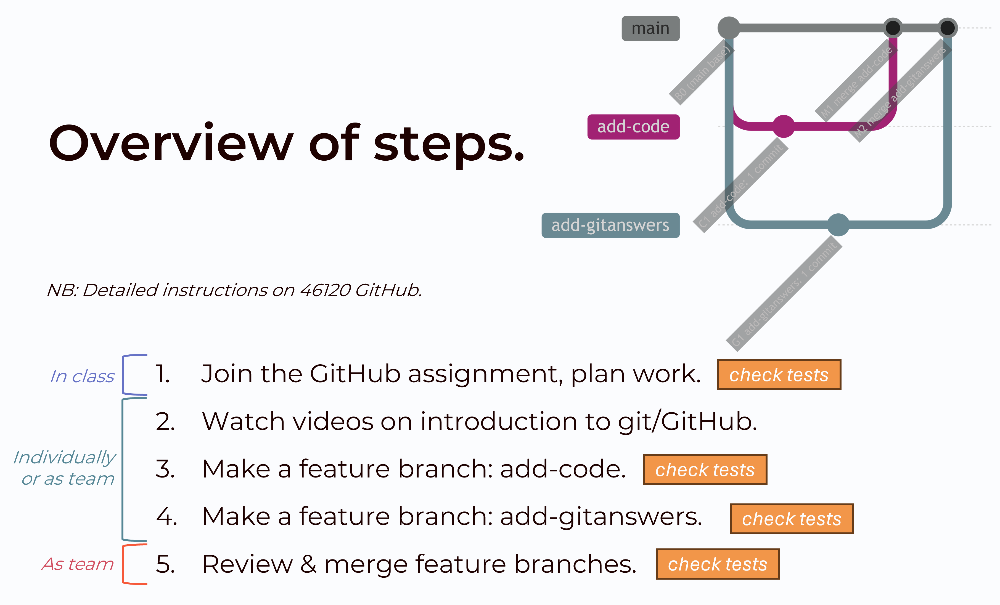

# PiWE Week 1: Course introduction and git/GitHub

Slides: to be pushed.

## Git: Distributed Version Management

Collaborate on code and make it run on several different machines while still keeping track of the
version history. This week, you will practice important workflows that are essential for developing and
collaborating on code.

## Overall objective
In a team of 2 to 3, create, review, and merge two “feature branches” such that all tests in test_week1.py pass.

## Homework due next week

These instructions intentionally do not spell out every step. A good portion
of scientific programming is finding/utilizing tutorials and guides online. Work together with your team and, of course, post in the Slack chat or come to office hours as needed.
You are done at the end of Part 3, when all PRs are merged and the tests pass.

### PART 1: In class with P0 Team

1. Form a team of 2 to 3 people (referred to as "P0 Team").  
   * This team is just for weeks 1 and 2.  
1. ONE person from your group:  
   * Under Learn / Content / Administration, click the link for the GitHub Assignment for Weeks 1 and 2.  
   * When prompted, create a new team. Call your team "P0 X", where "X" is replaced with some combination of your names. (E.g., a team with Anna, Bertha, and Clara could be "P0 AnBerClar")  
   * If you are asked to link your GitHub account to a "student identifier", the identifier should be your student ID or DTU username.  
1. Other group members should now click the same link on Learn for the GitHub assignment BUT join the existing team, "P0 X".  
   * If you are asked to link your GitHub account to a "student identifier", the identifier should be your student ID or DTU username.  
1. On the GitHub page for your team repo, click the "Star" button in the upper right corner.  
   * Now you can always find the repo on GitHub: click your profile icon in upper right corner and "Stars".  
1. Everyone clones the new team repo locally to their computer.  
1. Discuss with your team:  
   * Who will (1) author and who will (2) review which feature branches.  
      * An author of a feature branch may not be the reviewer of that branch.  
   * If you will complete Part 2 together, individually, or some blend of the two. Remember pair programming is encouraged!  
   * When you will meet to complete Part 3 and whether you will meet physically or virtually.  
1. Run the week1 test, which should FAIL for now:  
    * Open Anaconda prompt.  
    * Change directory to your team repo.  
    * Run pytest on the week1 test: `pytest test_week1.py`.  
    * There should be some white and red text and notes about failures, like this:  
        

### PART 2: Individually or with your team

All students shall complete Parts A and B.
Work in other parts is distributed per team's in-class discussion (Part 1).

#### A: Familiarize yourself with week1 tests

*NB: In general, you should not edit any test files provided by the instructors.*

1. Re-run the week1 tests using pytest if you do not still have the Anaconda Prompt open.  
1. Open the `test_week1.py` file in VS Code.  
1. Look through the functions. How many tests are there? In your own words, what is each function doing?  
1. Compare the pytest output to the functions. In your own words, why is each test failing? What could you do to make each test pass?  

#### B: Watch videos/tutorials

1. Watch the Git Basics videos: [Git Basics video series with Ju Feng and Jenni](https://panopto.dtu.dk/Panopto/Pages/Sessions/List.aspx?folderID=de5b944f-9e31-4b2d-8477-b27a00f792db).  
   * 5 videos with both theory and live coding. Approximately 1 hour in total.  
1. Watch/read [(Video) Atlassian tutorial on branches](https://www.atlassian.com/git/tutorials/using-branches).  
   * 4-minute video, plus text.  
1. Watch this tutorial on [how to review a Pull Request on GitHub](https://www.youtube.com/watch?v=TO9xK4XTBbQ).  
   * About 8 minutes long, but packed with good information. Pause and take notes as needed.  
  
*Optional*:  
 * [Review a PR directly in VS Code](https://www.youtube.com/watch?v=DSl-L6B_Qb4) [5:32]

#### C: Make feature branch/PR with week00 code

1. Create a new branch to add your solutions to the Week 00 assignment and name it something that describes the feature this branch is implementing (e.g., `add-code`).  
1. Create a folder called `preclass_assignment` in the top level of the repo. In this folder, place your solution to the preparatory Python exercises you completed before Week 1.
1. Add/commit your code to the branch.  
1. Push your branch to GitHub.  
1. Open a Pull Request (PR) for your feature branch and assign the pre-agreed group member as the reviewer.  

#### D: Make feature branch/PR with answers to git questions

*Looking for a challenge? Have 2+ team members collaboratively work on GitAnswers.md. Whether this means different-author commits on the same branch or multiple PRs is up to you. Bonus points if you create/resolve merge conflicts!*

1. Create a new branch to add your answers to git questions and name it something that describes the feature this branch is implementing (e.g., `add-gitanswers`).  
1. Create a text file called `GitAnswers.md` in the top level of the repo, add your answers to the
   the git questions below, and push it.  
1. Open a Pull Request (PR) for your feature branch and assign the pre-agreed group member as the reviewer.  

### PART 3: Together with P0 Team

Review and merge the feature branches. Make sure you watched the tutorial on how to review a PR on GitHub.

*NB: You don't always need to review PRs synchronously as a team. But it's good practice when getting started with PRs or with complex PRs.*

1. Choose one of the open PRs.  
1. The reviewer of a PR shows their screen and goes through the "Conversation", "Commits", and "Files Changed" tabs in the PR. Discuss with the team.  
1. The reviewer starts a Review based on the discussion with the team. The final review decision can be Comment, Approve, or Request changes at the reviewer's discretion.  
1. If any changes are requested, the author of the PR addresses them.  
1. Once the PR is eventually approved, the author can merge it.  
1. All team members update their local copies of `main` branch.  
    * Hint: the steps are to switch into the main branch, then pull.  
1. Repeat for the second PR.  
1. On GitHub, click the Insights tab, then "Network". What do you see?  
1. Everyone pull and run the week1 tests again. If you get a set of green dots and green text that says 4 passed, like below, you're done! Great work!  

## Git questions to answer

In `GitAnswers.md`, write 1 to 2 sentences to answer each of the following
questions.  (Note that for question 6 you will need to also push an image.)

1.	What is the difference between git and GitHub?  
2.	What is the difference between GitLab, GitHub, and BitBucket?  
3.	Why would I ever want to use git without GitHub?  
4.	What are the steps to update the remote GitHub repo with some changes I made on my computer?  
5.	What is a branch and why would I use one?  
6.	How would you visualize a branch with 3 commits, and then another branch that breaks off after the second commit and has a single commit?  
7.	Give an example of a set of git commands that would result in a merge conflict.  
8.	Is Git suitable for latex documents?  
9.	Should I from now on version my word and powerpoint slides using git? Why/why not?  
10.	What could happen when I push my latest commit to the remote repository without pulling first?  
11.	What happens when I pull without commiting my local changes first?  
12.	What is the difference between branching and forking?

## Videos, tutorials, and cheatsheets

### Recommended

 * [Git cheat sheet](https://education.github.com/git-cheat-sheet-education.pdf)  
   A good reference of the most common commands

### Extra resources

 * [Video: Cloning, pushing and pulling by Jenni](https://panopto.dtu.dk/Panopto/Pages/Viewer.aspx?id=49668227-45c1-48ee-bc99-b1070104253e).  
   A quick demo of cloning, pushing and pulling.
 * [Video: Introduction to git and GitLab by Jenni](https://panopto.dtu.dk/Panopto/Pages/Viewer.aspx?id=531326d3-6572-4b7b-8273-af9b00bd5cfe).  
   Review of basic commands, but also mentions branching and merging, gitignores, READMEs, etc.
 * [Detailed slides from Kai Heussen on git](./KaiHeussen_GitWorkshop.pdf).  
   Background on git/GitLab but also a lot of examples of git terminal commands.
 * [GitHub docs on pull requests](https://docs.github.com/en/pull-requests/collaborating-with-pull-requests/proposing-changes-to-your-work-with-pull-requests/about-pull-requests).  
 * [GitHub tutorial on how to review pull requests](https://docs.github.com/en/pull-requests/collaborating-with-pull-requests/reviewing-changes-in-pull-requests/reviewing-proposed-changes-in-a-pull-request).  
 * [Atlassian tutorial on add/commit/stash/gitignore](https://www.atlassian.com/git/tutorials/saving-changes)
 * [Atlassian tutorial on merge conflicts](https://www.atlassian.com/git/tutorials/using-branches/merge-conflicts)
